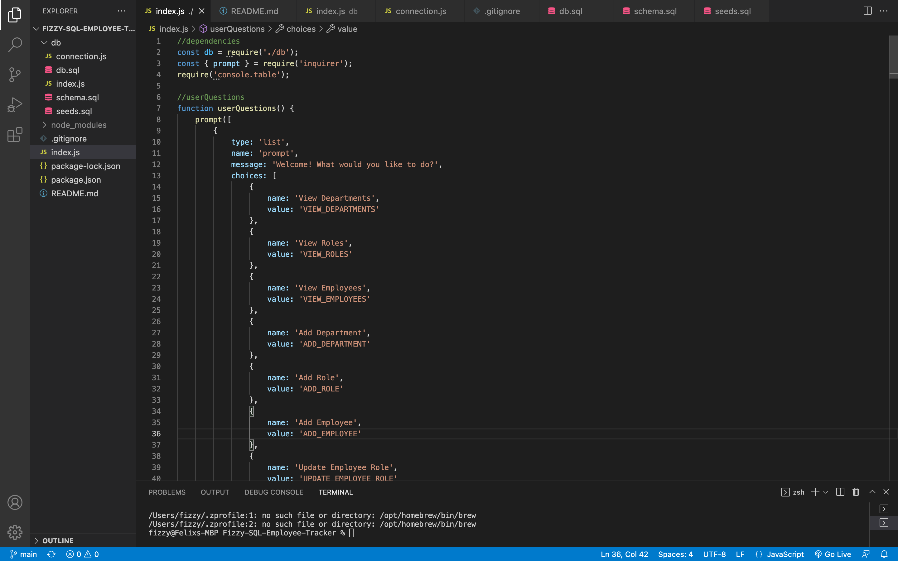
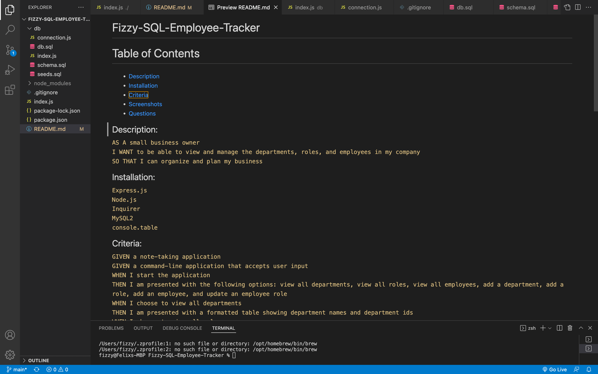
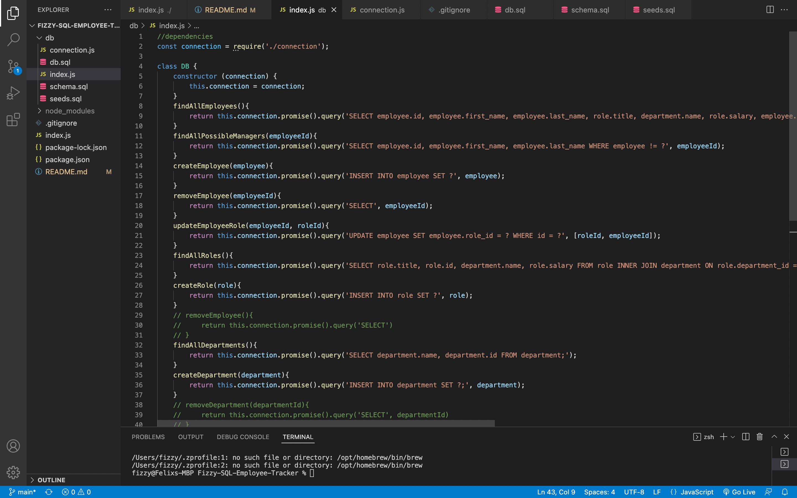
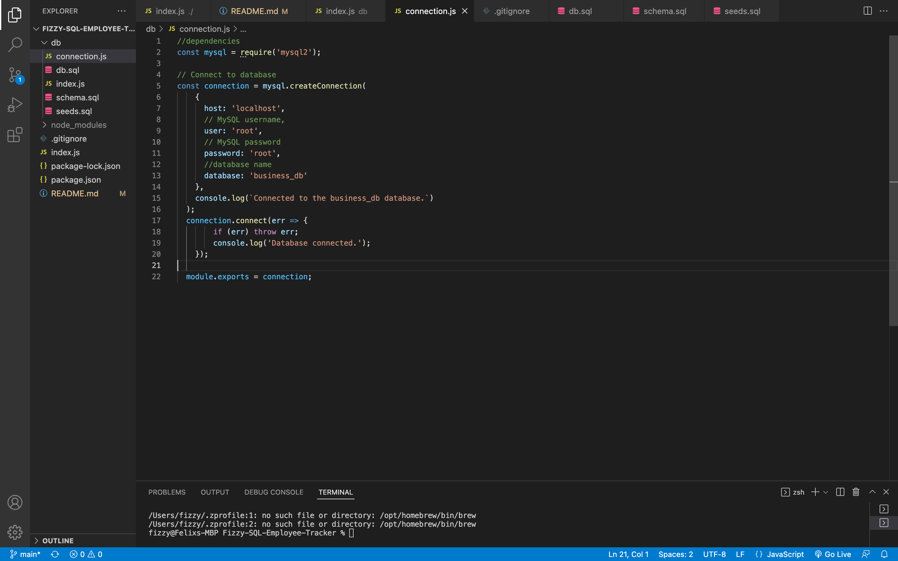
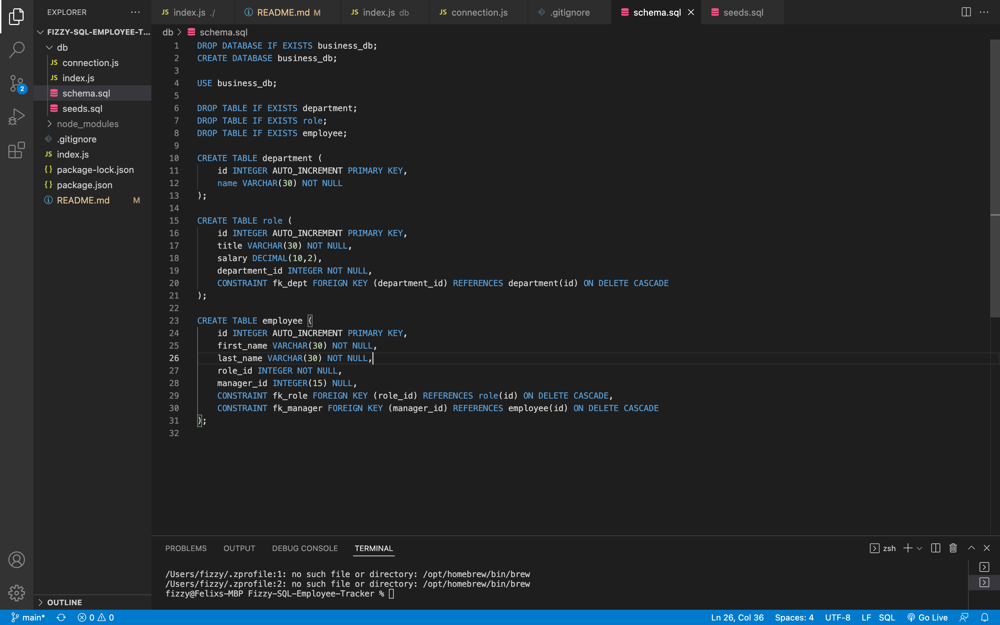
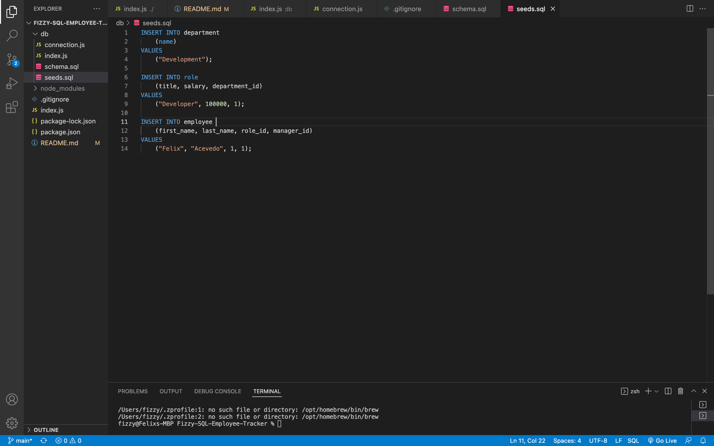

# Fizzy-SQL-Employee-Tracker

# Table of Contents
* [Description](#description)
* [Installation](#installation)
* [Criteria](#criteria)
* [Screenshots](#screenshots)
* [Questions](#questions)

## Description:

``AS A small business owner``
 ``I WANT to be able to view and manage the departments, roles, and employees in my company``
 ``SO THAT I can organize and plan my business``

## Installation:

`` Express.js ``
  `` Node.js ``
  `` Inquirer ``
  `` MySQL2 ``
  `` console.table ``

## Criteria:

``GIVEN a note-taking application``
 ``GIVEN a command-line application that accepts user input``
 ``WHEN I start the application``
 ``THEN I am presented with the following options: view all departments, view all roles, view all employees, add a department, add a role, add an employee, and update an employee role
``
 ``WHEN I choose to view all departments
``
 ``THEN I am presented with a formatted table showing department names and department ids
``
 ``WHEN I choose to view all roles
``
 ``THEN I am presented with the job title, role id, the department that role belongs to, and the salary for that role
``
 ``WHEN I choose to view all employees
``
 ``THEN I am presented with a formatted table showing employee data, including employee ids, first names, last names, job titles, departments, salaries, and managers that the employees report to
``
 ``WHEN I choose to add a department
``
 ``THEN I am prompted to enter the name of the department and that department is added to the database
``
 ``WHEN I choose to add a role
``
 ``THEN I am prompted to enter the name, salary, and department for the role and that role is added to the database
``
 ``WHEN I choose to add an employee
``
 ``THEN I am prompted to enter the employee’s first name, last name, role, and manager, and that employee is added to the database
``
 ``WHEN I choose to update an employee role
``
 ``THEN I am prompted to select an employee to update and their new role and this information is updated in the database
``

## Screenshots:

## Questions:

GitHub:

https://github.com/FelixA-GitHub

Video Walkthrough:

https://drive.google.com/file/d/1o5WzXWUFlKBswzeFI94SaIvM2iohTXQM/view

If you have additional questions, you can reach me at:

elmalogato@hotmail.com